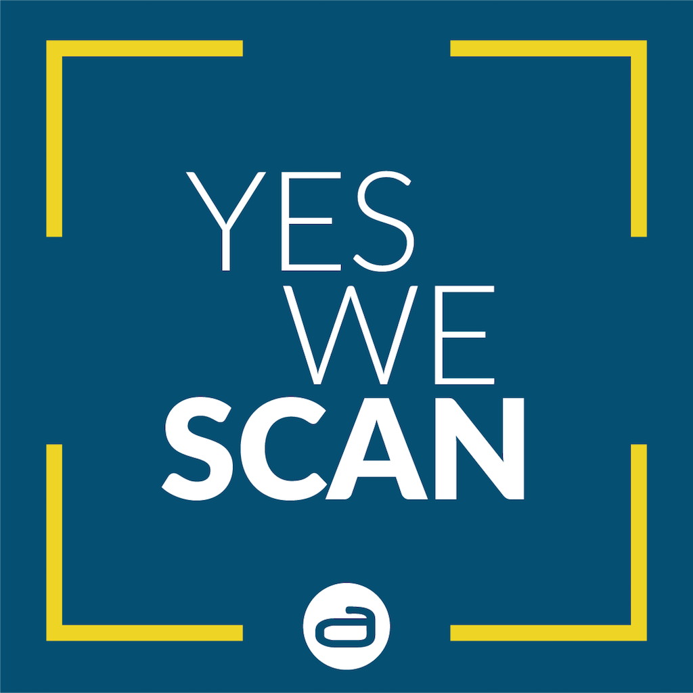
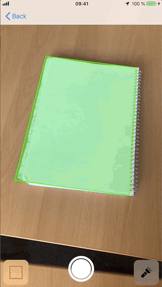

[](https://travis-ci.com/adorsys/document-scanner-ios.svg?branch=master)
[](https://swift.org)
[](https://github.com/adorsys/document-scanner-ios/blob/master/LICENSE)
[](https://img.shields.io/badge/platform-iOS_10+-lightgrey.svg)
[](https://github.com/Carthage/Carthage)


This pod contains a ready to use view controller for document scanning. Yes we scan!

## Requirements
- iOS 10.0 SDK or later

## Scanner Preview



## Installation

### Cocoapods

YesWeScan is available through [CocoaPods](http://cocoapods.org).
To install it, simply add the following line to your `Podfile`:

```ruby
pod 'YesWeScan'
```

### Carthage

YesWeScan is also available via [Carthage](https://github.com/Carthage/Carthage).
Add the following line to your `Cartfile`:

```
github "adorsys/document-scanner-ios"
```

## Using this Pod

### Scanner View Controller

The main class in this project is `ScannerViewController`. You can access it
with `import YesWeScan`.

```swift
class ViewController: UIViewController,  {
  var scannedImage: UIImage?

  override func viewDidLoad() {
    super.viewDidLoad()
    let scanner = ScannerViewController()
    scanner.delegate = self
    navigationController?.pushViewController(scanner, animated: true)
  }
}
```

### Delegate Methods

The scanner will __not__ capture images without a delegate.
You should therefore set the `delegate` property of the scanner VC.

You will then receive calls when the scanner found an image of suitable quality:

```swift
extension ViewController: ScannerViewControllerDelegate {
  func didCapture(image: UIImage) {
    scannedImage = image
    navigationController?.popViewController(animated: true)
  }
}
```

### Scanner Quality

You can customize the scanner's accuracy using the `jitter` property. Higher
values will make it easier to capture an image, but it won't be as steady.

The default value here is `100`.

The Scanner resolution can be configured by passing the `ScannerViewController`
an `AVCaptureSession.Preset` during initialization. The default value is
`.high`. If the given preset isn't supported by the capture device, it'll fall
back to the default value.

### Image Features needed before automatically capture

By default, image will be automatically captured when there're 7
RectangleFeatures. You can change that setting by modifying a variable for the
`ScannerViewController`.

```
scanner.featuresRequired = 7
```

### UI Configuration

The scanner's UI can be configured using the initializer:

```swift
ScannerViewController(config: [.torch, .manualCapture])
```

The following options are available:

+ `.targetBraces`: A button to toggle targeting braces
+ `.torch`: A button for controlling the torch
+ `.manualCapture`: A manual camera shutter

The default value here is `.all`

You can also configure the `previewColor` (color of scan preview rect) and
`braceColor` (color of the target finder braces).

The defaults here are `UIColor.green` and `UIColor.red`, respectively.

### Performance hint

The scanner takes quite some time to fire up the AVCaptureSession, etc, which
means initializing a `ScannerViewController` is expensive.

Depending on your use case, it probably makes sense to store a strong reference
to the `ScannerViewController` in the presenting View Controller (as seen in
the Example project).

### Siri Shortcuts

The scanner example project supports Siri Shortcuts since iOS 12*.
The User own shortcut opens the app and navigates to the Document Scanner.
You can find the implementation in the example project.

The implementation works as follows:
Activate Siri in the project and add a `NSUserActivityTypes` identifier in `info.plist`.
Then activate Siri Shortcut adding following lines in the project:

```swift
if #available(iOS 12.0, *) {
    let identifier = Bundle.main.userActivityIdentifier
    let activity = NSUserActivity(activityType: identifier)
    activity.title = "The String the User will see in preferences"
    activity.userInfo = ["Document Scanner" : "open document scanner"]
    activity.isEligibleForSearch = true
    activity.isEligibleForPrediction = true
    activity.persistentIdentifier = NSUserActivityPersistentIdentifier(identifier)
    view.userActivity = activity
    activity.becomeCurrent()
}
```

To call a specific function add in the `AppDelegate.swift` file:

```swift
func application(_ application: UIApplication, continue userActivity: NSUserActivity, restorationHandler: @escaping ([UIUserActivityRestoring]?) -> Void) -> Bool {
    if #available(iOS 12.0, *) {
        if userActivity.activityType == Bundle.main.userActivityIdentifier {
            let navigationController = window?.rootViewController! as! UINavigationController
            let viewController = navigationController.children.first as! ViewController
            viewController.theFunctionToCall()
        }
        return true
    }
    return false
}
```

## License

YesWeScan is released under the **Apache 2.0 License**. Please see the [LICENSE](https://github.com/adorsys/document-scanner-ios/blob/master/LICENSE) file for more information.
